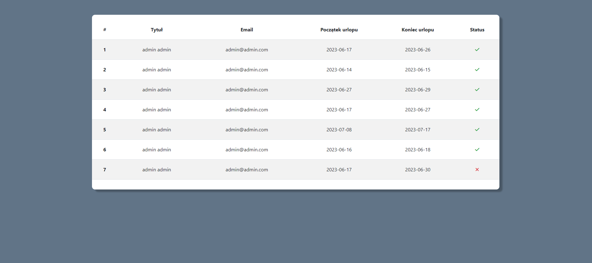
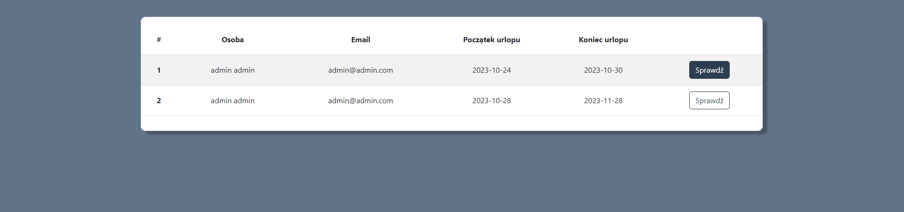
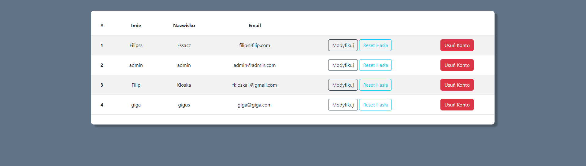
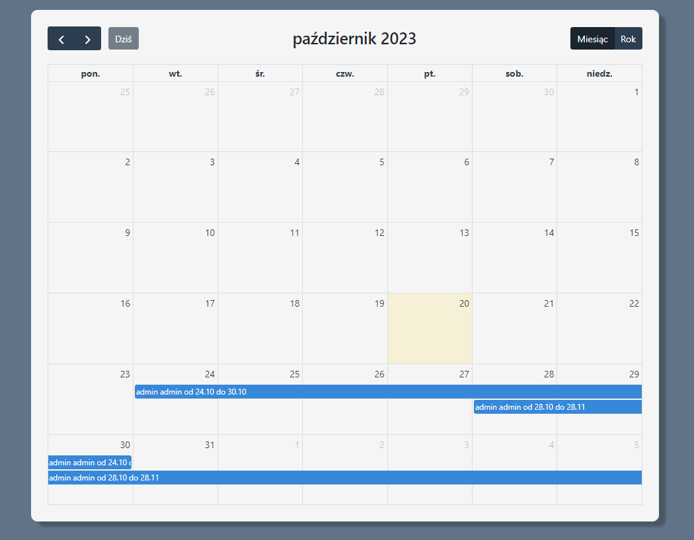

# HolidaysPHP

>[!IMPORTANT]
>**Admin Login**  
>login: admin@admin.com  
>password: admin

**Holiday Employee Allocation System application is a tool built in PHP and utilizing the Bootstrap framework also using FullCalendar package, designed to help businesses and organizations efficiently organize and manage their available workforce. The purpose of this application is to effectively allocate tasks or substitutions to employees when others are unavailable for various reasons, such as vacation, illness, or other commitments.**  

1. **Login and Authorization**: The application starts with a login page where employees and management can log in using their unique credentials. The system is protected against unauthorized access.
2. **Dashboard**: After logging in, users are directed to the main navigation panel, which displays important statistics and information about employee availability and upcoming tasks.
3. **Employee Management**: The application allows for adding, editing, and deleting employee profiles. Each profile can contain information such as first name, last name, job position, hourly availability, skills, and a history of assigned tasks.
4. **Availability Calendar**: Within the application, there is a calendar that shows the availability of each employee over a specified time frame. Employees can update their availability and request days off, while management can plan based on this information.
5. **User-Friendly Interface**: By using the Bootstrap framework, the application offers an intuitive and responsive interface that can be accessed on various devices, making it convenient for both office-based and field employees.
6. **Database Management: The application relies on a database to store employee data, task details, availability, and other pertinent information.**

**TECH STACK: Bootstrap,HTML,CSS,PHP, JS, MySQL**

## Screenshots

